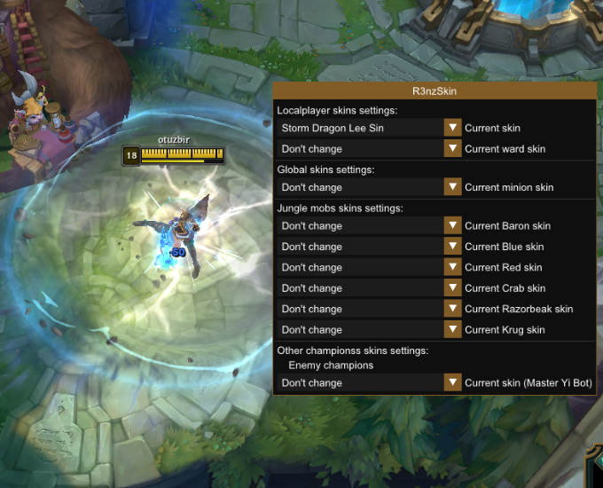

 

 
 

 

# R3nzSkin

  

`R3nzSkin` is internal skin changer for League of Legends.

- Use any available skin for your champion, or any other in game, enemy or ally.
- Automatic skins database update.
- Change skin for lane minions.
- In-game configuration with <a href="https://github.com/ocornut/imgui">ImGui</a>.
- Configure your jungle mobs skins like baron, red, blue.
- Change skins anytime and unlimited times in single game.
- Support for spectator mode.
- <a href="https://github.com/nlohmann/json">JSON</a> based configuration saving & loading.

# Building
1. Clone the source with `git clone --recursive https://github.com/R3nzTheCodeGOD/R3nzSkin.git`
2. Build in Visual Studio 2017/19 with configuration "Release | x86"

# Usage
1. Use `R3nzSkin_Injector` or inject the resulting DLL into the game yourself.
   - *Administrator* privilege may be needed if failed to inject.
   - League client can crash if injected before going into arena.
      - A workaround is to not inject until you are in the arena (you will need to be fast to not disrupt the game).
2. Press <kbd>Insert</kbd> to bring up the menu.
3. Select skin for you, your teammates, enemies, wards, etc.

# Workaround for mid-game crashes
## Solution 1

  

## Solution 2
If you turn off the cheat using the <kbd>unhook</kbd> button in the cheat menu after choosing the costume you will use in the game, your game will never crash.

# Further optimizations
If your CPU supports AVX / AVX2 / AVX-512 instruction set, you can enable it in project settings. This should result in more performant code, optimized for your CPU. Currently SSE2 instructions are selected in project settings.

# License
<b>This project is licensed under the MIT license</b>

See the <a href="https://github.com/R3nzTheCodeGOD/R3nzSkin/blob/master/LICENSE">LICENSE</a> file for more details.
